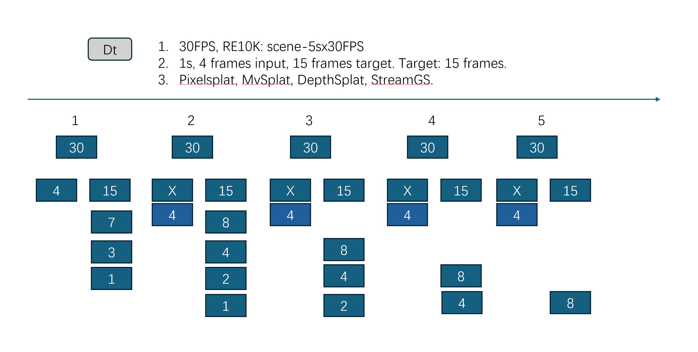

# How to test voxelspat and depthsplat of their streaming performance.

1. We need a 4s test to evaluate how the model performs in a streaming input.

If the depthsplat performs well at the first second, then do they also perform well at the second second? For the depthsplat, they are kindof overfitting, so it will perform well. But will it forget the first second.
Yes, it will forget. But it doesn't matter, since we have had a new scene. But wait, it means any new input comes, a new feedforward needs perform. It takes about 0.06s for 2 frames. So it gets about 16 fps. But for a real-time streaming, we hope it gets 30 fps or 60 fps. So it is not good.

Our first goal is to aciheve 1 min streaming with 30 fps.

2. Do we really need active perception?

Yes, for sure. Since we cannot afford to feedforward the whole model for each new input frame. So we need to do active perception to select which part of the model to feedforward.